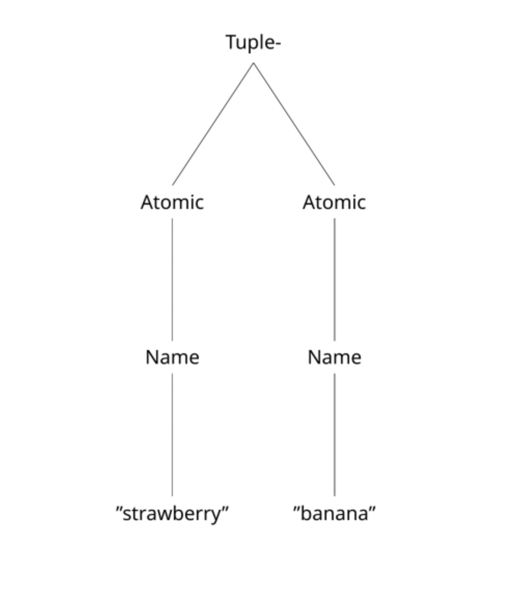

# Basics of Interpretation


<!-- WARNING: THIS FILE WAS AUTOGENERATED! DO NOT EDIT! -->

# Overview of this Section

In this section we will broadly discuss how to represent interpretation
in programming languages encoded high-dimensional vector space. In order
to work up to this point, first we will discuss some problems with the
memory capacity of VSAs: specifically, how we can get around
information-loss as a result of VSA operations by using *associative
memories*. Then, we will discuss other ways of representing syntax.
Finally, we will talk about what is interpretation and program execution
by thinking about a way of talking about how programs work:
[*denotational
semantics*](https://en.wikipedia.org/wiki/Denotational_semantics). We
will then apply this knowledge to another toy language, the LET
language.

# Associative Memories and Pointers

Recall our previous example of encoding the simple language
ℒ<sub>fruit</sub> in high-dimensional vectors. We found that we can both
*encode* the abstract syntax into the high-dimensional vectors using VSA
operations, as well as decode them.

But, as we will show, the decoding breaks down with even 1-deep nesting
of syntax. We say that a composite expression *ϕ* is *n*-deep by
counting the longest length of composite sub-expressions that it
contains. Atomic expressions are 0-deep. Ideally, for languages which
are compositional, we would like for any syntactic expression to be able
to be arbitrarily deep. So, we could have a tuple of tuples of tuples of
tuples, etc. But, because of the information loss inherent in VSA
operations, we quickly find that without some indirection, this becomes
untenable.

``` python
from dataclasses import dataclass
from abc import ABCMeta


@dataclass
class L(metaclass=ABCMeta):
    """Abstract base class of our language L."""

    pass


@dataclass
class Atomic(L):
    """Abstract base class of atomic elements in the language."""

    name: str


@dataclass
class Tuple(L):
    """Tuples in L."""

    lhs: L
    rhs: L


@dataclass
class Disjunction(L):
    """Disjunctions in L."""

    lhs: L
    rhs: L


dim = 1_000
T = ["atomic", "tuple", "disjunction"]
R = ["tag", "name", "lhs", "rhs"]
A = ["strawberry", "banana", "apple"]
codebook = Codebook(T + R + A, dim=dim)


def encode(expr: L, codebook: Codebook = codebook) -> HRR:
    """Encode a formula in the language $\mathcal{L}_{\text{fruit}}$."""
    if not isinstance(expr, L):
        raise TypeError("Expected a subclass of L", expr)

    if isinstance(expr, Atomic):
        name = expr.name
        return role_filler_pair(
            {
                "tag": "atomic",
                "name": codebook[name],
            },
            codebook=codebook,
        )
    elif isinstance(expr, Tuple):
        lhs = expr.lhs
        rhs = expr.rhs
        return role_filler_pair(
            {
                "tag": "tuple",
                "lhs": encode(lhs, codebook=codebook),
                "rhs": encode(rhs, codebook=codebook),
            },
            codebook=codebook,
        )
    elif isinstance(expr, Disjunction):
        lhs = expr.lhs
        rhs = expr.rhs
        return role_filler_pair(
            {
                "tag": "disjunction",
                "lhs": encode(lhs, codebook=codebook),
                "rhs": encode(rhs, codebook=codebook),
            },
            codebook=codebook,
        )


def decode(enc: HRR, codebook=codebook, theta: float = 0.2) -> L:
    """Decode a representation back to ``L``."""
    tag = enc.bind(codebook["tag"].inverse())
    t_atom = codebook["atomic"]
    t_tuple = codebook["tuple"]
    t_disj = codebook["disjunction"]

    if tag.cosine_similarity(t_atom) > theta:
        name = enc.bind(codebook["name"].inverse())

        # Recall the name from the codebook
        keys, values = zip(*codebook.items())
        V = np.array(values)
        sims = V @ name
        argmax = np.argmax(sims)

        return Atomic(keys[argmax])
    else:
        # Trick here is that both of the other representations have
        # an `lhs` and a `rhs`.
        lhs = enc.bind(codebook["lhs"].inverse())
        rhs = enc.bind(codebook["rhs"].inverse())
        dec_lhs = decode(lhs, codebook=codebook, theta=theta)
        dec_rhs = decode(rhs, codebook=codebook, theta=theta)
        if tag.cosine_similarity(t_tuple) > theta:
            return Tuple(dec_lhs, dec_rhs)
        elif tag.cosine_similarity(t_disj) > theta:
            return Disjunction(dec_lhs, dec_rhs)
        else:
            raise ValueError("Unkown value!")


# Testing tuples:
straw = Atomic("strawberry")
apple = Atomic("apple")
enc_apple = encode(apple)
tupl = Tuple(straw, apple)
print(f"Original form: {tupl}")
enc_tupl = encode(tupl)
dec_tupl = decode(enc_tupl)
print(f"Decoded form: {dec_tupl}")

print()

# Testing one-deep disjunctions
# disj = Disjunction(tupl, apple)           # Uncommenting this throws errors
# print(f"Original form: {disj}")
# enc_disj = encode(disj)
# dec_disj = decode(enc_disj)
# print(f"Decoded form: {dec_disj}")
```

    Original form: Tuple(lhs=Atomic(name='strawberry'), rhs=Atomic(name='apple'))
    Decoded form: Tuple(lhs=Atomic(name='strawberry'), rhs=Atomic(name='apple'))

Even with a simple 1-deep expression, our decoding function is unable to
parse out that the left-hand side of `enc_disj` is a tuple. The key
problem here is that we can think of VSA operations as a kind of
information compression. Specifically, binding leads to a loss of
information, and this loss depends on the kind of binding operation that
we use [(Kelly *et al.*,
2013)](https://psycnet.apa.org/doiLanding?doi=10.1037%2Fa0030301).

To solve this problem, we need to be able to add (1) indirection into
the representation, allowing for the information to be preserved even
under many binding operations, (2) a way to “clean-up” or “clarify”
noisy representations, gravitating them back to their original form.

To do this, we use *associative memories*, which are distributed,
content-addressable memories that recontsruct queries based on stored
information in their weights. Associative memories are well-suited for
our high-dimensional representation as they are continuous and
differentiable as well.

## Creating a Cleanup and Associative Memory

For more intuition here, we will be creating both a cleanup and
associative memory. A cleanup memory 𝒞 is an auto-associative memory
which stores *N* high-dimensional vectors of dimension *D*. If *x* is a
high-dimensional vector stored in the weights of 𝒞, then 𝒞(*x*) ≈ *x*.
If *x*′ is a degraded form of a stored memory item in *C*, then
𝒞(*x*′) ≈ *x*, where *x* is the original form of the memory item.
Cleanup memories are useful for recovering the original form of bound
variables.

The next associative memory that we will be using is a
hetero-associative memory 𝒟 that stores *N* × *N* items, or *N*
addresses of high-dimensional vectors and *N* patterns of
high-dimensional vectors. We write to memory both an address vector and
a pattern vector. If *x* is a high-dimensional vector stored in the
addresses in 𝒟, and *y* is the a high-dimensional vector stored in the
patterns of 𝒟 associated with *x* (i.e., the row in both the pattern and
address matrix is the same), then 𝒟(*x*) ≈ *y*. If *x*′ likewise is a
degraded form of *x*, and *y* the stored pattern for *x*, then
𝒟(*x*′) ≈ *y*.

``` python
class CleanupMem:
    """Simple clean-up memory."""

    def __init__(self, dim: int, init_capacity: int = 20) -> None:
        # The dimensionality of the data
        self.dim = dim
        # The current capacity of the memory
        self.capacity = init_capacity
        # The number of stored traces
        self.stored_traces = 0
        # The weight matrix
        self.W = np.zeros(shape=(init_capacity, dim))

    def write(self, x: np.ndarray) -> np.ndarray:
        """Write a value to memory."""
        if self.stored_traces >= self.capacity:
            self.W = np.concatenate([self.W, np.zeros((self.capacity, self.dim))])
            self.capacity *= 2
        self.W[self.stored_traces, :] = x
        self.stored_traces += 1
        return x

    def read(self, x: np.ndarray) -> tuple[np.ndarray, np.ndarray]:
        """Read a value from memory, returning the value and its recalled form"""
        similarities = self.W @ x
        max_sim_idx = np.argmax(np.abs(similarities))
        recalled = self.W[max_sim_idx]
        return x, recalled.view(HRR)

    def __call__(self, x: np.ndarray) -> tuple[np.ndarray, np.ndarray]:
        return self.read(x)


class AssocMem:
    def __init__(self, dim: int, init_capacity: int = 20) -> None:
        self.dim = dim
        self.capacity = init_capacity
        self.stored_traces = 0
        # addresses
        self.A = np.zeros((self.capacity, self.dim))
        # patterns
        self.P = np.zeros((self.capacity, self.dim))

    def write(self, x: np.ndarray, y: np.ndarray) -> tuple[np.ndarray, np.ndarray]:
        """Associate `(x, y)` in memory, returning the values."""
        if self.stored_traces >= self.capacity:
            self.A = np.concatenate([self.A, np.zeros((self.capacity, self.dim))])
            self.P = np.concatenate([self.P, np.zeros((self.capacity, self.dim))])
            self.capacity *= 2
        self.A[self.stored_traces, :] = x
        self.P[self.stored_traces, :] = y
        self.stored_traces += 1
        return x, y.view(HRR)

    def read(self, x: np.ndarray) -> tuple[np.ndarray, np.ndarray]:
        """Read `x` from memory, returning the `x` and the resulting value."""
        similarities = self.A @ x
        max_sim_idx = np.argmax(np.abs(similarities))
        recalled_pattern = self.P[max_sim_idx]
        return x, recalled_pattern.view(HRR)

    def __call__(self, x: np.ndarray) -> tuple[np.ndarray, np.ndarray]:
        return self.read(x)
```

Let’s see how these work. For the cleanup memory, we should be able to
degrade a value and still be able to retrieve the original form.

``` python
dim = 400
X = random(10, dim)
cleanup_mem = CleanupMem(dim=dim)
for x in X:
    cleanup_mem.write(x)

# Test regular recall
x = X[1].squeeze()
_, x_hat = cleanup_mem(x)
print(f"Cosine sim between x and x_hat: {x.cosine_similarity(x_hat)}")

x_degraded = X[1].bind(X[0]).bind(X[2]).bind(X[0].inverse()).bind(X[2].inverse())
_, x_deg_hat = cleanup_mem(x_degraded)
print(f"Cosine sim between x and x_deg_hat: {x.cosine_similarity(x_deg_hat)}")
```

    Cosine sim between x and x_hat: 1.0
    Cosine sim between x and x_deg_hat: 1.0

Likewise, we should be able to recall arbitrary associated values even
under degradation.

``` python
dim = 400
A = random(10, dim)
P = random(10, dim)
assoc = AssocMem(dim)
for a, p in zip(A, P):
    assoc.write(a, p)

a = A[1]
p = P[1]
_, p_hat = assoc(a)
print(
    f"Cosine sim between target pattern and recalled pattern: {p.cosine_similarity(p_hat)}"
)

a_degraded = A[1].bind(A[0]).bind(A[2]).bind(A[0].inverse()).bind(A[2].inverse())
_, p_deg_hat = assoc(a_degraded)
print(
    f"Cosine similarity between target pattern and recalled pattern from degraded value: {p_deg_hat.cosine_similarity(p)}"
)
```

    Cosine sim between target pattern and recalled pattern: 1.0000000000000002
    Cosine similarity between target pattern and recalled pattern from degraded value: 1.0000000000000002

## Applying memories to encoding and decoding

Now that we have an associative memory and a cleanup memory, how do we
apply it to decoding so that we can preserve information? Recall that
role-filler pair encodings for syntactic forms has some degradation of
information, especially whenever we have multiple binds and
superpositions. Therefore, for each new role-filler pair that we create,
what we will do is create a *reference*. We say that a fresh, random
vector *p* is a reference for some high-dimensional vector *x* if *p* is
arbitrary and unrelated with *x*, and we associate *p* with *x* in
associative memory.

We also can store the contents of role-filler pairs in cleanup memory.
This helps further with the preservation of information in role-filler
pairs. Figuring out when and when not to use these methods of
indirection unfortunately has no real theory behind it. Rather, it is a
practical decision made whenever we notice lots of information loss.

Furthermore, instead of using explicit tag roles, what we will do is
explicitly superpose the role-filler pair of the contents of the syntax
with the tag itself. This let’s us do easier comparison, as well as
further limits the possiblity of information loss.

``` python
def encode_with_references(
    expr: L,
    codebook: Codebook,
    assoc_mem: AssocMem,
    cleanup: CleanupMem,
) -> HRR:
    """Encode an expression with references and indirection."""

    if isinstance(expr, Atomic):
        name = expr.name
        rf = role_filler_pair(
            {
                "name": name,
            },
            codebook=codebook,
        )
        return rf + codebook["atomic"]
    elif isinstance(expr, Tuple):
        lhs = expr.lhs
        rhs = expr.rhs

        enc_lhs = encode_with_references(
            lhs, codebook=codebook, assoc_mem=assoc_mem, cleanup=cleanup
        )
        enc_rhs = encode_with_references(
            rhs, codebook=codebook, assoc_mem=assoc_mem, cleanup=cleanup
        )

        cleanup.write(enc_lhs)
        cleanup.write(enc_rhs)

        rfpair = (
            role_filler_pair(
                {"lhs": enc_lhs, "rhs": enc_rhs},
                codebook=codebook,
            )
            + codebook["tuple"]
        )
        ptr = random(1, codebook.dim).squeeze()
        assoc_mem.write(ptr, rfpair)
        return ptr
    elif isinstance(expr, Disjunction):
        lhs = expr.lhs
        rhs = expr.rhs

        enc_lhs = encode_with_references(
            lhs, codebook=codebook, assoc_mem=assoc_mem, cleanup=cleanup
        )
        enc_rhs = encode_with_references(
            rhs, codebook=codebook, assoc_mem=assoc_mem, cleanup=cleanup
        )

        cleanup.write(enc_lhs)
        cleanup.write(enc_rhs)

        rfpair = (
            role_filler_pair(
                {"lhs": enc_lhs, "rhs": enc_rhs},
                codebook=codebook,
            )
            + codebook["disjunction"]
        )
        ptr = random(1, codebook.dim).squeeze()
        assoc_mem.write(ptr, rfpair)
        return ptr


dim = 1_000
T = ["atomic", "tuple", "disjunction"]
R = ["tag", "name", "lhs", "rhs"]
A = ["strawberry", "banana", "apple"]
codebook = Codebook(T + R + A, dim=dim)

cleanup_mem = CleanupMem(dim=codebook.dim)
for item in codebook.values():
    cleanup_mem.write(item)
assoc_mem = AssocMem(dim=dim)

straw = Atomic("strawberry")
enc_straw = encode_with_references(
    straw, codebook=codebook, assoc_mem=assoc_mem, cleanup=cleanup_mem
)
print(
    f"Is the encoded `straw` atomic?: {enc_straw.cosine_similarity(codebook['atomic'])}"
)
```

    Is the encoded `straw` atomic?: 0.7015074268173801

``` python
# Testing tuples
banana = Atomic("banana")
enc_banana = encode_with_references(
    banana, codebook=codebook, assoc_mem=assoc_mem, cleanup=cleanup_mem
)

t = Tuple(straw, banana)
ptr_t = encode_with_references(
    t, codebook=codebook, assoc_mem=assoc_mem, cleanup=cleanup_mem
)

print(f"Is the pointer a tuple?: {ptr_t.cosine_similarity(codebook['tuple'])}")

_, deref_t = assoc_mem.read(ptr_t)

print(
    f"Is the derefenced tuple a tuple?: {deref_t.cosine_similarity(codebook['tuple'])}"
)
lhs = deref_t.bind(codebook["lhs"].inverse())
_, lhs = cleanup_mem.read(lhs)
print(f"Similarity between lhs and atomic: {lhs.cosine_similarity(codebook['atomic'])}")
print(
    f"Is the lhs a strawberry?: {lhs.bind(codebook['name'].inverse()).cosine_similarity(codebook['strawberry'])}"
)
```

    Is the pointer a tuple?: -0.012625734991703514
    Is the derefenced tuple a tuple?: 0.5754711851450405
    Similarity between lhs and atomic: 0.7015074268173801
    Is the lhs a strawberry?: 0.5825174657553933

#### Decoding

Now that we’ve preserved the information more using indirection, we can
also have an easier time in decoding compound representations.

``` python
t = Tuple(straw, banana)
t_nest = Tuple(t, t)
ptr_t = encode_with_references(
    t_nest, codebook=codebook, assoc_mem=assoc_mem, cleanup=cleanup_mem
)

_, deref_t = assoc_mem.read(ptr_t)
_, lhs_ptr = cleanup_mem.read(deref_t.bind(codebook["lhs"].inverse()))
_, deref_lhs = assoc_mem.read(lhs_ptr)
print(
    f"Is the left-hand side a tuple?: {deref_lhs.cosine_similarity(codebook['tuple'])}"
)
```

    Is the left-hand side a tuple?: 0.5754711851450405

Implementing decoding the forms with indirection is left as an exercise
for the reader. It is always important to remember: you can not be sure
that a value that you have is an atomic value that isn’t the result of
some kind of indirection. Therefore, one must always be wary of testing
for whether the value is atomic. To do so, one can simply test whether
some high-dimensional encoded vector is sufficiently similar to the
`atomic` tag. Otherwise, you can treat it as a reference, and
dereference it from memory.

``` python
def decode_with_references(
    enc: HRR,
    codebook: Codebook,
    assoc_mem: AssocMem,
    cleanup_mem: CleanupMem,
) -> L:
    """Decode from our novel encoding with references."""
    ...
```

# Alternative Representations of Syntax

Role-filler pairs are not the only way to represent the abstract syntax
of a language. VSAs are able to express really any useful data structure
that one could desire: the question then becomes, what is the most
useful for the project itself. Aside from role-filler pairs, we can also
represent the abstract syntax as *trees* or *sequences*. The two main
strategies for representing these structures are either some iteration
of role-filler pairs.

## Trees

The abstract syntax of a language can be represented as a *tree* using a
data structure called a *sparse coordinate tree* [(Soulos, *et al.*,
2024)](https://arxiv.org/pdf/2412.14076v1). The representation uses two
codebooks for *content*, the
*C* = \[*c*<sub>1</sub>, *c*<sub>2</sub>, …, *c*<sub>*N*</sub>\] and
*position*:
*P* = \[*p*<sub>1</sub>, *p*<sub>2</sub>, …, *p*<sub>*M*</sub>\]. Each
*p*<sub>*i*</sub>, *i* = 1, …, *M* denotes *M* possible coordinates
within the tree. Soulos, *et al.* have some indexing information in the
position vectors *p*<sub>*i*</sub>, but as long as they are sufficiently
distinct they can be anything. Another possible option is to use the set
of permutations of some base vector *p*<sub>1</sub>, and the other
vectors as:
$$
\begin{align\*}
p_2 &= \mathcal{P}^1(p_1), \\
p_3 &= \mathcal{P}^2(p_1), \\
&\vdots \\
p_m &= \mathcal{P}^{(m-1)}(p_1),
\end{align\*}
\tag{1}
$$
where 𝒫<sup>*n*</sup>(⋅) denotes the *n*-th permutation of the vector
argument.

Permutations can also be used to “protect” information. Recall that
binding creates a new vector which is orthogonal to the operands of the
binding. Therefore, if we bind each filler with *n* permutations of a
role, then we create a new and highly uncorrelated vector that is
uniquely recoverable by taking the inverse of the bind with the *n*
permutation vectors.

This encoding scheme is intimately related with the tagged unions that
tactic that we use above. Instead of using *distinct* roles for the
attributes of the abstract syntax, instead they use an agnostic
representation that represents the abstract syntax as tree.

Consider the following tree: 

With our tagged union representation, this is:
*t*<sub>rf</sub> = `tuple` ⊕ ((`lhs` ⊗ (`atomic` ⊕ (`name` ⊗ `strawberry`))) ⊕ (`rhs` ⊗ (`atomic` ⊕ (`name` ⊗ `banana`))))
For our positional encoding, let us assign the positions left-hand side
first, so the top of the tree is *p*<sub>1</sub>, going down the left
hand branch we have *p*<sub>2</sub>, *p*<sub>3</sub>, *p*<sub>4</sub>,
and the right hand side
*p*<sub>5</sub>, *p*<sub>6</sub>, *p*<sub>7</sub>. The representation
would be:
$$
\begin{align\*}
t\_\text{pos} &= p_1 \otimes \texttt{tuple} \oplus p_2 \otimes \texttt{atomic} \oplus \\
    &p_3 \otimes \texttt{name} \oplus p_4 \otimes \texttt{strawberry} \\
    &p_5 \otimes \texttt{atomic} \oplus p_6 \otimes \texttt{name} \\
    &p_7 \otimes \texttt{banana}.
\end{align\*}
\tag{3}
$$
This naive representation will of course be subject to problems of
noise. But, there are smarter ways of doing this positional encoding.
For example, another tree representation from [Frady, *et al.*
(2020)](https://arxiv.org/pdf/2007.03748) is to use permutations of a
*left* and a *right* base vector.

## Lists

Similar to the tree representation, we can use a sort of linked-list
structure for encoding the syntax. In this approach, we simply have a
codebook of structural roles: `left`, `right`, the empty list indicator
`nil`, and a list marker *φ*, accompanied with a codebook of values that
we wish to have as elements.

Encoding atomic symbols remains a simple mapping from the symbol to the
codebook. However, for non-atomic structures (composite expressions), we
can concatenate the elements into a list by using the cons operation:
cons(*x*, *y*) = (`left` ⊗ *x*) ⊕ (`right` ⊗ *y*) ⊕ *φ*.
A singleton list is represented as cons(*x*, `nil`). This allows us to
simply iterate through the list until by retrieving the `left` item,
performing our operation, and then treating the retrieved value from the
`right`.

Like our tagged-union representations these unfortunately are plagued
with problems of noise. So, we must unfortunately enter *x* and *y* into
cleanup memory to enhance recall. Given the ease of this representation,
we will be using this for encoding abstract syntax. We’ll see an example
below of how this works in practice. Before that, however, we must end
our detour and talk about what programs mean: *semantics*.

# It’s just semantics

Semantics is, broadly, the study of what some language *means*. In
natural language, the semantics investigates how the meaning of words
makes a difference in how we can use them and what we do with them. For
example, the famous sentence: “Colorless green ideas sleep furiously” is
*syntactically* correct, but there is a different sense to why it seems
wrong. There’s something about the words themselves that makes it a bad
kind of sentence.

In the same way that we can talk about the meaning of words in natural
language, the study of semantics extends to formal languages as well. In
fact, semantics for natural language finds it origin in thinkers like
Richard Montague (1930-1971), who claimed that there was no intrinsic
difference between natural and artificial languages. So, we could use
the tools for the latter on the former.

Programming language semantics provide a way for us to describe how we
intend the programming language to work. Usually, we proceed with a
higher-level description of the general “shape” of how things are
supposed to work. The job of compilers and interpretation is to
implement these semantic rules as faithfully as possible. The reason
that we provide a high-level and abstract definition of the semantics of
programming languages is because we want to leave room for the writers
of compilers and interpreters to perform optimizations. If our language
standard, that is the document which formally describes the language in
total, requires that the language have a very specific and *inefficient*
implementation, implementers would have to break with the standard to
make something fast and useful. But this would just be a violation of
what it means to be a language standard (something that all
implementations ought to follow).

## Designing a denotation

Given a language ℒ, typically described by a list of syntactic roles,
designing the semantics of the language requires us to define a function
that, on the basis of the syntax of the language, assigns some meaning
or *denotation* to the syntax.

To put it in simpler terms, we need to provide a function that maps from
the syntax of ℒ to some other domain that captures the essential
properties of ℒ. We call this function the *denotation* function,
denoted by ∥⋅∥.

### A denotation for ℒ<sub>fruit</sub>

To provide an intuition here, suppose that ℒ<sub>fruit</sub> is a
programming language, and we want to design a semantics for this
programming language. Of course, this language wouldn’t be very useful,
except for describing collections of strawberries, bananas, and apples.
But, it is good practice to begin to grasp what it takes to make a
denotation.

To begin, we have to proceed recursively over the inductive definition
of ℒ<sub>fruit</sub>. By defining the denotation in terms of atomic
elements as a base case, and then composite elements, we are following
something known as the *principle of compositionality*: namely, that the
meaning of an expression in the language ℒ<sub>let</sub> is determined
the meaning of the parts of the expression.

Let ℳ<sub>fruit</sub> be a set called the *model* of ℒ<sub>fruit</sub>.
The denotation function ∥⋅∥ maps from elements in ℒ<sub>fruit</sub> to
elements in ℳ<sub>fruit</sub>. To begin, we need to populate
ℳ<sub>fruit</sub>. First, we need to have elements that correspond with
the atomic elements of ℒ<sub>fruit</sub>. Let strawberry, apple, and
banana be three elements in ℳ<sub>fruit</sub>. We can distinguish
between elements in ℳ<sub>fruit</sub> and atomic elements in
ℒ<sub>fruit</sub> by the lack of serifs. The denotation of atomic
elements is thus:
$$
\begin{align\*}
\\ \texttt{apple} \\ &= \mathsf{apple}, \\
\\ \texttt{banana} \\ &= \mathsf{banana}, \\
\\ \texttt{strawberry} \\ &= \mathsf{strawberry}.
\end{align\*}
\tag{5}
$$

Next, we have to populate the composite expressions. For tuples, we will
say that (1) the denotation of the left-hand side is in
ℳ<sub>fruit</sub>, (2) the denotation of the right-hand side is in
ℳ<sub>fruit</sub>, and (3) that the set of {∥lhs∥, {∥lhs∥, ∥rhs∥}} is in
ℳ<sub>fruit</sub> (the set encoding of a tuple):
$$
\begin{align\*}
\\ (x, y) \\ = \\ \\ x \\, \\ \\ x \\, \\y\\\\\\.
\end{align\*}
\tag{6}
$$

## Real-world example

A real-world example of how actual language specifications define the
operational semantics of a language is the [R5RS Standard for
Scheme](https://conservatory.scheme.org/schemers/Documents/Standards/R5RS/r5rs.pdf).

# The LET Programming Language

Now that we have an understanding of representing the syntax of
programming languages, as well as the semantics, let’s work out a toy
example.

The LET Programming language [(Friedman & Wand, 2008; Ch.
3)](https://www.eopl3.com) is a toy language that contains: simple
expressions like addition and subtraction, testing whether or not an
item is 0, function application, conditional evaluation, and variable
binding using `let` expressions.

Let ℒ<sub>let</sub> be the language defined by the following BNF
specification:

``` bnf
<program> ::= <expression>

<expression> ::= <number>   
              |  -(<expression>, <expression>)
              | zero? (<expression>)
              | if <expression> then <expression> else <expression>
              | <identifier>
              | let <expression> = <expression> in <expression>
```

``` python
@dataclass
class Expression(metaclass=ABCMeta):
    """Abstract base class of Let expressions."""

    pass


@dataclass
class Number(Expression):
    """Number expressions."""

    num: int


@dataclass
class Identifier(Expression):
    """Identifier expressions."""

    var: str


@dataclass
class IsZero(Expression):
    """zero?"""

    exp1: Expression


@dataclass
class If(Expression):
    """If expressions."""

    exp1: Expression
    exp2: Expression
    exp3: Expression


@dataclass
class Let(Expression):
    """let expressions."""

    var: str
    exp1: Expression
    body: Expression


@dataclass
class Diff(Expression):
    """Difference expressions"""

    exp1: Expression
    exp2: Expression
```

Next, we define our encoding function. We’re going to use the list
encoding that we talked about earlier. Numbers and identifiers will be
atomic expressions. For numbers, we’re going to cheat a little bit by
keeping an varying size array of “scalar vectors” around, called it
ℐ = \[*i*<sub>0</sub>, *i*<sub>1</sub>, …\]. The encoding for some
number *n* will just be *i*<sub>*n*</sub>. We will then superpose this
representation with a tag `num`.

For composite expressions, we will use a list encoding. The first
element of the list will be a tag denoting what kind of expression it
is. These can be either −, `let`, `if`, or `zero?`.

``` python
# Setting up the environment
dim = 1_000
T = ["-", "let", "if", "zero?", "num"]
K = ["φ", "lhs", "rhs", "nil"]
I = random(100, dim)  # the dynamic array containing our number vectors

codebook = Codebook(T + K, dim=dim)  # we'll update the codebook with new,
# user-defined symbols as we encounter them


assoc_mem = AssocMem(dim=codebook.dim)
cleanup_mem = CleanupMem(dim=codebook.dim)
for val in codebook.values():
    cleanup_mem.write(val)


def make_cons(
    lhs: HRR,
    rhs: HRR,
    codebook: Codebook,
    assoc_mem: AssocMem,
    cleanup_mem: CleanupMem,
) -> HRR:
    """Helper function for making pointers."""
    lhs = cleanup_mem.write(lhs)
    rhs = cleanup_mem.write(rhs)

    tup = (lhs.bind(codebook["lhs"])) + (rhs.bind(codebook["rhs"])) + codebook["φ"]
    tup = tup / np.linalg.vector_norm(tup)
    ptr = random(1, codebook.dim).squeeze()
    assoc_mem.write(ptr, tup)
    return ptr


def cons(
    xs: list[HRR], codebook: Codebook, assoc_mem: AssocMem, cleanup_mem: CleanupMem
) -> HRR:
    base = codebook["nil"]
    for x in reversed(xs):
        base = make_cons(x, base, codebook, assoc_mem, cleanup_mem)
    return base


def encode_let(
    e: Expression, codebook: Codebook, assoc_mem: AssocMem, cleanup_mem: CleanupMem
) -> HRR:
    """Encode our LET Language using our list encoding."""
    global I

    if isinstance(e, Identifier):
        val = e.var
        if val not in codebook:
            codebook[val] = random(1, codebook.dim).squeeze()
        return codebook[val]
    elif isinstance(e, Number):
        num = e.num
        if num >= I.shape[0]:
            I = np.concatenate([I, np.random(100, dim)])
        return I[num] + codebook["num"]
    elif isinstance(e, IsZero):
        exp1 = e.exp1
        enc_exp1 = encode_let(exp1, codebook, assoc_mem, cleanup_mem)
        return cons([codebook["zero?"], enc_exp1], codebook, assoc_mem, cleanup_mem)
    elif isinstance(e, If):
        exp1 = e.exp1
        exp2 = e.exp2
        exp3 = e.exp3

        enc_exp1 = encode_let(exp1, codebook, assoc_mem, cleanup_mem)
        enc_exp2 = encode_let(exp2, codebook, assoc_mem, cleanup_mem)
        enc_exp3 = encode_let(exp3, codebook, assoc_mem, cleanup_mem)

        return cons(
            [
                codebook["if"],
                enc_exp1,
                enc_exp2,
                enc_exp3,
            ],
            codebook,
            assoc_mem,
            cleanup_mem,
        )
    elif isinstance(e, Let):
        var = e.var
        exp1 = e.exp1
        body = e.body

        enc_var = None
        if var in codebook:
            enc_var = codebook[var]
        else:
            codebook[var] = random(1, codebook.dim).squeeze()
            enc_var = codebook[var]

        enc_exp1 = encode_let(exp1, codebook, assoc_mem, cleanup_mem)
        enc_body = encode_let(body, codebook, assoc_mem, cleanup_mem)

        return cons(
            [
                codebook["let"],
                enc_var,
                enc_exp1,
                enc_body,
            ],
            codebook,
            assoc_mem,
            cleanup_mem,
        )
    elif isinstance(e, Diff):
        exp1 = e.exp1
        exp2 = e.exp2

        exp1 = encode_let(exp1, codebook, assoc_mem, cleanup_mem)
        exp2 = encode_let(exp2, codebook, assoc_mem, cleanup_mem)

        return cons(
            [
                codebook["-"],
                exp1,
                exp2,
            ],
            codebook,
            assoc_mem,
            cleanup_mem,
        )
```

To verify the correctness of our encoding, we will also define a
decoding function to return the expressions to a human-readable format.

``` python
def is_atomic(
    x: HRR, codebook: Codebook, assoc_mem: AssocMem, theta: float = 0.2
) -> bool:
    "Test if a value is atomic"

    # Test to see if the value is a pointer; i.e., if the value is in
    # the address space of the associative memory
    addrs = assoc_mem.A
    dot = addrs @ x
    max_cosine_sim = np.argmax(dot)
    return dot[max_cosine_sim] < theta


def is_int(x: HRR, codebook: Codebook, theta: float = 0.2) -> bool:
    "Test if a value is a number"
    return x.cosine_similarity(codebook["num"]) > theta


def car(
    x: HRR, codebook: Codebook, assoc_mem: AssocMem, cleanup_mem: CleanupMem, is_ptr: bool = False
) -> HRR:
    """Retrieve the head of a list."""
    if is_ptr:
        _, x = cleanup_mem.read(x)
        _, x = assoc_mem.read(x)
    head = x.bind(codebook["lhs"].inverse())
    _, head = cleanup_mem.read(head)
    return head


def cdr(
    x: HRR, codebook: Codebook, assoc_mem: AssocMem, cleanup_mem: CleanupMem, is_ptr: bool = False
) -> HRR:
    """Retrieve the tail of a list."""
    if is_ptr:
        _, x = cleanup_mem.read(x)
        _, x = assoc_mem.read(x)
    tail = x.bind(codebook["rhs"].inverse())
    _, tail = cleanup_mem.read(tail)
    return tail


def is_nil(x: HRR, codebook: Codebook, theta: float = 0.2) -> HRR:
    """Test if a value is `== codebook['nil']`."""
    return x.cosine_similarity(codebook["nil"]) > theta


def decode_let(
    enc: HRR,
    codebook: Codebook,
    assoc_mem: AssocMem,
    cleanup_mem: CleanupMem,
    theta: float = 0.2,
) -> Expression:
    """Decode a let expression from HRR back to Python object."""

    if is_atomic(enc, codebook, assoc_mem):
        if is_int(enc, codebook):
            sims = I @ enc
            max_sim_idx = np.argmax(sims)
            return Number(max_sim_idx)
        else:
            keys, values = zip(*codebook.items())
            values = np.array(values)
            sims = values @ enc
            max_sim_idx = np.argmax(sims)
            name = keys[max_sim_idx]
            return Identifier(name)

    # The value is non-atomic, meaning that it needs to be de-referenced.
    _, deref = assoc_mem.read(enc)

    head = car(deref, codebook, assoc_mem, cleanup_mem)
    if head.cosine_similarity(codebook["zero?"]) > theta:
        cdr_ = cdr(deref, codebook, assoc_mem, cleanup_mem)
        enc_exp1 = car(cdr_, codebook, assoc_mem, cleanup_mem, is_ptr=True)
        exp1 = decode_let(enc_exp1, codebook, assoc_mem, cleanup_mem)
        return IsZero(exp1)
    elif head.cosine_similarity(codebook["if"]) > theta:
        cdr_ = cdr(deref, codebook, assoc_mem, cleanup_mem)
        enc_exp1 = car(cdr_, codebook, assoc_mem, cleanup_mem, is_ptr=True)
        cddr_ = cdr(cdr_, codebook, assoc_mem, cleanup_mem, is_ptr=True)
        enc_exp2 = car(cddr_, codebook, assoc_mem, cleanup_mem, is_ptr=True)
        cdddr_ = cdr(cddr_, codebook, assoc_mem, cleanup_mem, is_ptr=True)
        enc_exp3 = car(cdddr_, codebook, assoc_mem, cleanup_mem, is_ptr=True)

        exp1 = decode_let(enc_exp1, codebook, assoc_mem, cleanup_mem, theta=theta)
        exp2 = decode_let(enc_exp2, codebook, assoc_mem, cleanup_mem, theta=theta)
        exp3 = decode_let(enc_exp3, codebook, assoc_mem, cleanup_mem, theta=theta)

        return If(exp1, exp2, exp3)
    elif head.cosine_similarity(codebook["let"]) > theta:
        cdr_ = cdr(deref, codebook, assoc_mem, cleanup_mem)
        enc_exp1 = car(cdr_, codebook, assoc_mem, cleanup_mem, is_ptr=True)
        cddr_ = cdr(cdr_, codebook, assoc_mem, cleanup_mem, is_ptr=True)
        enc_exp2 = car(cddr_, codebook, assoc_mem, cleanup_mem, is_ptr=True)
        cdddr_ = cdr(cddr_, codebook, assoc_mem, cleanup_mem, is_ptr=True)
        enc_exp3 = car(cdddr_, codebook, assoc_mem, cleanup_mem, is_ptr=True)

        exp1 = decode_let(enc_exp1, codebook, assoc_mem, cleanup_mem, theta=theta)
        exp2 = decode_let(enc_exp2, codebook, assoc_mem, cleanup_mem, theta=theta)
        exp3 = decode_let(enc_exp3, codebook, assoc_mem, cleanup_mem, theta=theta)

        return Let(exp1, exp2, exp3)
    elif head.cosine_similarity(codebook["-"]) > theta:
        cdr_ = cdr(deref, codebook, assoc_mem, cleanup_mem)
        enc_exp1 = car(cdr_, codebook, assoc_mem, cleanup_mem, is_ptr=True)
        cddr_ = cdr(cdr_, codebook, assoc_mem, cleanup_mem, is_ptr=True)
        enc_exp2 = car(cddr_, codebook, assoc_mem, cleanup_mem, is_ptr=True)

        exp1 = decode_let(enc_exp1, codebook, assoc_mem, cleanup_mem, theta=theta)
        exp2 = decode_let(enc_exp2, codebook, assoc_mem, cleanup_mem, theta=theta)
        return Diff(exp1, exp2)
```

``` python
x = Identifier("foo")
enc_x = encode_let(x, codebook, assoc_mem, cleanup_mem)
print(decode_let(enc_x, codebook, assoc_mem, cleanup_mem))

n = Number(3)
enc_n = encode_let(n, codebook, assoc_mem, cleanup_mem)
print(decode_let(enc_n, codebook, assoc_mem, cleanup_mem))

z = IsZero(x)
enc_z = encode_let(z, codebook, assoc_mem, cleanup_mem)
print(decode_let(enc_z, codebook, assoc_mem, cleanup_mem))

d = Diff(n, n)
print(f"Original expression: {d}")
enc_d = encode_let(d, codebook, assoc_mem, cleanup_mem)
print(decode_let(enc_d, codebook, assoc_mem, cleanup_mem))

i = If(n, z, d)
print(f"Original expression: {d}")
enc_i = encode_let(i, codebook, assoc_mem, cleanup_mem)
print(decode_let(enc_i, codebook, assoc_mem, cleanup_mem))

let = Let("bar", z, d)
print(f"Original expression: {let}")
enc_l = encode_let(let, codebook, assoc_mem, cleanup_mem)
print(decode_let(enc_l, codebook, assoc_mem, cleanup_mem))
```

    Identifier(var='foo')
    Number(num=np.int64(3))
    IsZero(exp1=Identifier(var='foo'))
    Original expression: Diff(exp1=Number(num=3), exp2=Number(num=3))
    Diff(exp1=Number(num=np.int64(3)), exp2=Number(num=np.int64(3)))
    Original expression: Diff(exp1=Number(num=3), exp2=Number(num=3))
    If(exp1=Number(num=np.int64(3)), exp2=IsZero(exp1=Identifier(var='foo')), exp3=Diff(exp1=Number(num=np.int64(3)), exp2=Number(num=np.int64(3))))
    Original expression: Let(var='bar', exp1=IsZero(exp1=Identifier(var='foo')), body=Diff(exp1=Number(num=3), exp2=Number(num=3)))
    Let(var=Identifier(var='bar'), exp1=IsZero(exp1=Identifier(var='foo')), body=Diff(exp1=Number(num=np.int64(3)), exp2=Number(num=np.int64(3))))

## The Semantics for ℒ<sub>let</sub>

The semantics of ℒ<sub>let</sub> require us to provide some function and
set definitions. We will list them below, and then we will informally
discuss what they are and what they do:

$$
\begin{align}
\text{Var} &= \\x_1, x_2, \dots\\ \tag{7}  \\
\mathcal{n} &= \\n_1, n_2, \dots \\ \tag{8} \\
\mathcal{A} &: \mathbb{R}^D \to \mathbb{R}^D \tag{9} \\
\mathcal{C} &: \mathbb{R}^D \to \mathbb{R}^D \tag{10} \\
\mathcal{X} &: \text{Var} \to \mathbb{R}^D \tag{11} \\
\mathcal{I} &: \mathbb{N} \to \mathbb{R}^D \tag{12} \\
\mathsf{checkInt} &: \mathbb{R}^D \to \\0, 1\\  \tag{13} \\
\mathsf{expandToN} &: (\mathcal{I} \times \mathbb{N}) \to \mathcal{I} \tag {14}\\
\mathsf{diff} &: (\mathbb{R}^D \times \mathbb{R}^D \times \mathcal{I}) \to \mathbb{R}^D \tag{15} \\
(\cdot \gets \cdot) &: (\mathcal{C} \times \mathbb{R}^D) \to \mathbb{0} \tag{16} \\
(\cdot \gets (\cdot, \cdot)) &: (\mathcal{A} \times \mathbb{R}^D \times \mathbb{R}^D) \to \mathbb{0} \tag{17} \\
\mathsf{updateCodebook} &: (\mathcal{X} \times \text{Var}) \to \mathbb{0} \tag{18} \\
\end{align}
$$
