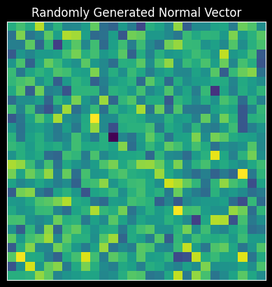

# An Introduction to VSAs


<!-- WARNING: THIS FILE WAS AUTOGENERATED! DO NOT EDIT! -->

# What’s a VSA

In this project we are going to be using Vector-Symbolic Architectures
(VSAs), or, Hyperdimensional Computing (HDC) to encode the symbolic
syntax of a programming language in high-dimensional vector space. But,
what is a VSA? A VSA first provides a method for mapping symbols to
high-dimensional vector. Suppose that we have a language ℒ which has
three atomic elements: `banana`, `strawberry`, and `apple`. The language
might have some further ways for composing these representations, and we
will investigate how to represent these later, but for right now we will
focus only on the atomic elements of the language.

The first step for doing VSA computation is to create a mapping *f*
which maps from the language ℒ to the high-dimensional vector space
*V*<sup>*D*</sup>. For simplicity, we will be considering only the
vector space ℝ<sup>*D*</sup>, but there are other VSAs which use
different vector spaces. For atomic elements, the mapping *f* takes
symbols in ℒ to rows to the *N* rows (one for each atomic element) of
*D*-dimension in the matrix *X* called the *codebook*:
*X* = \[*x*<sub>1</sub>, *x*<sub>2</sub>, …, *x*<sub>*N*</sub>\],
and for some atomic *s* ∈ ℒ, *f*(*s*) = *x*<sub>*i*</sub>.

> We are being very informal about the definition of the syntax but
> later on we will be more formal by providing an actual inductive
> definition.

Now that we have high-dimensional representations of each of the
symbols, how can we compose them? First, let us extend ℒ by adding the
operator (⋅, ⋅), which creates a “tuple” of elements in ℒ. For example,
the tuple of `banana` and `apple` is:
*t* = (`banana`, `apple`).

Intuitively, *t* ≠ apple ≠ banana, even though *t* is composed of the
atomic elements `apple` and `banana`. Therefore, we need some function
*d* defined over *X* such that for *x*<sub>*i*</sub>, *x*<sub>*j*</sub>,
$$
d (x_i, x_j) = \begin{cases}
    &1,~\text{if}~f^{-1}(x_i) = f^{-1}(x_j), \\
    &0,~\text{otherwise}.
\end{cases}
\tag{3}
$$
Given that we are in ℝ<sup>*D*</sup>, define
$d(x_i, x_j) = \frac{x_i \cdot x_j}{\\x_i\\\\x_j\\}$, or the *cosine
similarity*. This immediately gives us a function that is 1 iff
*x*<sub>*i*</sub> and *x*<sub>*j*</sub> are identical, and interpolates
to 0 as the vectors become more “dissimilar”.

Given that *D* is high-dimensional, the “blessing of dimensionality”
means that each *x*<sub>*i*</sub> and *x*<sub>*j*</sub>, *i* ≠ *j* are
“pseudo-orthogonal”, meaning, it is more likely than not that they are
dissimilar up to some constant *ϑ*:
*d*(*x*<sub>*i*</sub>, *x*<sub>*j*</sub>) = 0 + *ϑ*.
In order to encode the tuple function, we have to create a new
representation *out* of the component elements which is dissimilar to
the component elements. We can achieve this by an operation called
*bind*, where the *binding* of elements *x*<sub>*i*</sub> and
*x*<sub>*j*</sub>, denoted by *x*<sub>*i*</sub> ⊗ *x*<sub>*j*</sub>, is
such that:
$$
\begin{align\*}
d(x_i \otimes x_j, x_i) &= 0 + \vartheta, \\
d(x_i \otimes x_j, x_j) &= 0 + \vartheta.
\end{align\*}
\tag{5}
$$
Furthermore, *bind* must be invertible, where we have:
$$
\begin{align\*}
(x_i \otimes x_j) \otimes^{-1} x_i &= x_j + \kappa, \\
(x_i \otimes x_j) \otimes^{-1} x_j &= x_i + \kappa,
\end{align\*}
\tag{6}
$$
with *κ* being a noise term. This invertability is gives us the ability
to extract component elements of the tuple.

With binding defined, we can encode *t* from (2):
$$
\begin{align\*}
f((\texttt{banana},~\texttt{apple})) &= f(\texttt{banana}) \otimes f(\texttt{apple}), \\
&= x_i \otimes x_j.
\end{align\*}
\tag{7}
$$

For the final key component, let’s add another operator (⋅ ∨ ⋅), called
*disjunction*. We can read this as “either …, or …” of other elements in
ℒ. While tuples like *t* are completely dissimlar to their component
elements, disjunctions can either be one of their elements or the other.
For the sake of this model, we’ll say that we want the disjunction of
element *s*<sub>1</sub> ∈ ℒ and element *s*<sub>2</sub> ∈ ℒ to be
similar to components. In high-dimensional vector space, this can be
encoded as *superposition*, where for two vectors *x*<sub>*i*</sub> and
*x*<sub>*j*</sub>, the *superposition* of *x*<sub>*i*</sub> and
*x*<sub>*j*</sub>, denoted *x*<sub>*i*</sub> ⊕ *x*<sub>*j*</sub> is such
that:
$$
\begin{align\*}
d((x_i \otimes x_i), x_i) &= 1 - \vartheta , \\
d((x_i \otimes x_j), x_j) &= 1 - \vartheta.
\end{align\*}
\tag{8}
$$
With this defined, we can define the mapping *f* over disjunctions as:
$$
\begin{align\*}
f((\texttt{banana},~\texttt{apple})) &= f(\texttt{banana}) \oplus f(\texttt{apple}) \\
&= x_i \oplus x_j.
\end{align\*}
\tag{9}
$$
These three functions are the core of VSAs, and give us incredible
expressive capacity.

## Summary

VSAs are a model of symbolic structures which are able to express
compositional relationships between symbols as functions defined over
high-dimensional vector space. The key three operations used to encode
these symbolic relations are:

1.  **Similarity**: similarity between two high-dimensional vectors in
    Eq’n. (3), which is close to 1 when they are “the same” and close to
    0 when they aren’t.

2.  **Binding**: binding composes elements into a new, distinct symbol
    from their component parts. Binding satisfies the properties in
    Eq’n. (5).

3.  **Superposition**: also called *bundling* (as a dual with binding),
    that makes a new high-dimensional vector which is similar to the
    component elements, satisfying the properties in Eq’n. (8).

For the language ℒ defined as the minimal set which satisfies the
following properties:

1.  Atomic elements 𝒜 = {`apple`, `banana`, `strawberry`} are in the
    set.

2.  If *s* ∈ ℒ and *z* ∈ ℒ, then the *tuple* (*s*, *z*) is also in ℒ.

3.  If *s* ∈ ℒ and *z* ∈ ℒ, then the *disjunction* (*s* ∨ *z*) is in ℒ.

4.  Anything not satisfying the above requirements is not in ℒ.

We can define the encoding function *f*(ℒ) = ℝ<sup>*D*</sup>
inductively:

1.  If *x* is in 𝒜, then *f*(*x*) = *x*<sub>*i*</sub>, for
    *D*-dimensional row vector in the codebook *X*.

2.  If *ϕ* ∈ ℒ and *ψ* ∈ ℒ, then
    *f*((*ϕ*, *ψ*)) = *f*(*ϕ*) ⊗ *f*(*ψ*).

3.  If *ϕ* ∈ ℒ and *ψ* ∈ ℒ, then,
    *f*((*ϕ* ∨ *ψ*)) = *f*(*ϕ*) ⊕ *f*(*ψ*).

# Holographic Reduced Representations.

Holographic Reduced Representations (HRRs) will our VSA of choice for
this project [(Plate,
1995)](https://pages.ucsd.edu/~msereno/170/readings/06-Holographic.pdf).

HRRs use high-dimensional vectors in real space. For the binding
operator, we use circular convolution. Because circular convolution is
component-wise multiplication in Fourier space, we implement it using
the simple:
*x* ⊗ *y* = ℜ{ℱ<sup>−1</sup>\[ℱ(*x*)ℱ(*y*)\]},
with ℜ denoting the *real* components of the vector, discarding the
complex components; ℱ the Fourier transform, and ℱ<sup>−1</sup> the
*inverse* Fourier transform.

For the similarity measure we use cosine similarity, and for
superposition we use component-wise addition.

# Coding it up!

The definition above was a little bit abstract, but it should become
clearer once we have a coding implementation in our hands. We’re going
to use `numpy` as our numerical processing library, though we could do
any other (if we like).

``` python
class HRR(np.ndarray):
    """Thin wrapper around `np.ndarray` for Holographic Reduced Representations
    (HRRs).
    """

    # Incantation needed for subclassing `np.ndarray`.
    def __new__(cls, input_array) -> object:
        obj = np.asarray(input_array).view(cls)
        return obj

    # Same as above
    def __array_finalize__(self, obj: object) -> None:
        if obj is None:
            return

    # The binding operation.
    def bind(self, other: typing.Union[np.ndarray, "HRR"]) -> "HRR":
        """Perform circular convolution.

        Args:
            other (np.ndarray): Second argument.

        Returns:
            Circular convolution of the vector and the other.
        """
        return ifft(fft(self) * fft(other)).real.view(HRR)

    def inverse(self) -> "HRR":
        """Invert the vector for unbinding."""
        return self[np.r_[0, self.size - 1 : 0 : -1]].view(HRR)

    def cosine_similarity(self, other: typing.Union[np.ndarray, "HRR"]) -> float:
        return float((self.dot(other)) / (np.linalg.norm(self) * np.linalg.norm(other)))
```

We also need a way of generating new vectors. This function helps us
create arbitrary new symbols for each atomic symbol in the language ℒ.
To do this, we sample elements from the normal distribution:
$$
\mathcal{N}\left(\mu=1, \sigma = \frac{1}{d}\right),
$$
and then normalize them to unit magnitude.

``` python
def random(
    num_vectors: int,
    dim: int,
    dtype: npt.DTypeLike = float,
    rng=np.random.default_rng(),
) -> "HRR":
    r"""Create matrix of `n` `d`-dimensional HRR vectors, sampled from the normal
    distribution,
    $$
    \mathcal{N}(\mu=1, \sigma^2 = \frac{1}{d}),
    $$

    Args:
        num_vectors int: The number of vector symbols you wish to generate.
        dim int: The dimension of the vector symbols.
        dtype npt.DTypeLike: The `dtype` of the vector generated. Default: ``float``.
        rng: Random number generator.

    Returns:
        A ``(num_vectors, dim)`` matrix of random vector symbols.
    """
    sd = 1.0 / np.sqrt(dim)
    vs = rng.normal(scale=sd, size=(num_vectors, dim)).astype(dtype)
    norms = np.linalg.vector_norm(vs, axis=1, keepdims=True)
    vs /= norms
    return HRR.__new__(cls=HRR, input_array=vs)
```

We can inspect some randomly generated vectors.

``` python
X = random(2, 28 * 28)


def display_im(x, title=None):
    plt.imshow(x.reshape(28, 28))
    if title:
        plt.title(title)
    plt.xticks([])
    plt.yticks([])
    plt.show()


display_im(X[0], title="Randomly Generated Normal Vector")
```



We can also test our important measures: similarity, binding, and
superposition.

``` python
x_0 = X[0]
x_1 = X[1]

print(f"Cosine similarity between x_0 and x_1: {x_0.cosine_similarity(x_1)}")

t = x_0.bind(x_1)
print(f"Cosine similarity between x_0 and (x_0 * x_1): {x_0.cosine_similarity(t)}")

unbound = t.bind(x_1.inverse())
print(f"Cosine similarity between (t / x_1) and x_0: {unbound.cosine_similarity(x_0)}")

spose = x_0 + x_1
print(f"Cosine similarity between x_0 and (x_0 + x_1): {spose.cosine_similarity(x_0)}")
```

    Cosine similarity between x_0 and x_1: -0.004668307104146607
    Cosine similarity between x_0 and (x_0 * x_1): 0.1232672204723025
    Cosine similarity between (t / x_1) and x_0: 0.6961395290534296
    Cosine similarity between x_0 and (x_0 + x_1): 0.7054543546168858

# The Abstract Syntax of ℒ.

Now that we have the basics of VSAs. In fashion that will become more
typical, we will define the *abstract syntax* of our language ℒ. Recall,
ℒ has three basic parts: the atomic elements 𝒜, tuples, and
disjunctions.

We will define a representation for each of these, and then define an
*encoding* function *f* that maps these representations onto HRRs.

``` python
from dataclasses import dataclass
from abc import ABCMeta


@dataclass
class L(metaclass=ABCMeta):
    """Abstract base class of our language L."""

    pass


@dataclass
class Atomic(L):
    """Abstract base class of atomic elements in the language."""

    name: str


@dataclass
class Tuple(L):
    """Tuples in L."""

    lhs: L
    rhs: L


@dataclass
class Disjunction(L):
    """Disjunctions in L."""

    lhs: L
    rhs: L


def create_codebook(atomic_symbols: list[str], dim: int) -> HRR:
    """Create a codebook of atomic symbols.

    Args:
        atomic_symbols list[str]: The list of atomic symbols in the language.
        dim int: The dimension of the vector symbols corresponding to the atomic symbols.

    Returns:
        A ``(len(atomic_symbols), dim)`` matrix codebook.
    """
    N, D = len(atomic_symbols), dim
    return random(N, D)


def encode(expression: L, atomic_symbols: list[str], codebook: HRR) -> HRR:
    r"""Encode an expression in $\mathcal{L}$ to HRR.

    Args:
        expression L: The expression to encode.
        atomic_symbols list[str]: The list of atomic symbols.
        codebook HRR: ``(len(atomic_symbols), D)`` matrix codebook.

    Returns:
        The encoded form of the symbol.
    """

    if not isinstance(expression, L):
        raise TypeError("Expected argument to subclass `L`", expression)

    # Base case
    if isinstance(expression, Atomic):
        name = expression.name
        name_idx = atomic_symbols.index(name)
        return codebook[name_idx]
    # Inductive cases
    elif isinstance(expression, Tuple):
        lhs = expression.lhs
        rhs = expression.rhs
        return encode(lhs, atomic_symbols, codebook).bind(
            encode(rhs, atomic_symbols, codebook)
        )
    elif isinstance(expression, Disjunction):
        lhs = expression.lhs
        rhs = expression.rhs
        return encode(lhs, atomic_symbols, codebook) + encode(
            rhs, atomic_symbols, codebook
        )
```

Let’s test out our definitions to see if they maintain the same
properties that we expect: namely,

1.  Atomic symbols should be self-similar, but very dissimlar to other
    atomic symbols.

2.  We should be able to retrieve the component parts of tuples.

3.  And, disjunctions should be similar to both component parts.

``` python
dim = 400

apple = Atomic("apple")
strawberry = Atomic("strawberry")
banana = Atomic("banana")

atomic_names = ["apple", "strawberry", "banana"]
X = create_codebook(atomic_names, dim)
print(f"{X.shape = }")

enc_apple = encode(apple, atomic_names, X)
enc_straw = encode(strawberry, atomic_names, X)
enc_banana = encode(banana, atomic_names, X)

print(f"{enc_apple.cosine_similarity(enc_apple) = }")
print(f"{enc_apple.cosine_similarity(enc_straw) = }")
```

    X.shape = (3, 400)
    enc_apple.cosine_similarity(enc_apple) = 1.0000000000000002
    enc_apple.cosine_similarity(enc_straw) = 0.00039153428747147444

``` python
t = Tuple(banana, apple)
enc_t = encode(t, atomic_names, X)

print(f"Tuple similarity with encoded_apple: {enc_t.cosine_similarity(enc_apple):.2f}")
print(
    f"Tuple similarity with encoded_banana: {enc_t.cosine_similarity(enc_banana):.2f}"
)
```

    Tuple similarity with encoded_apple: 0.09
    Tuple similarity with encoded_banana: 0.03

``` python
d = Disjunction(banana, apple)
enc_d = encode(d, atomic_names, X)

print(
    f"Disjunction similarity with encoded_apple: {enc_d.cosine_similarity(enc_apple):.2f}"
)
print(
    f"Disjunction similarity with encoded_banana: {enc_d.cosine_similarity(enc_banana):.2f}"
)
```

    Disjunction similarity with encoded_apple: 0.72
    Disjunction similarity with encoded_banana: 0.72

# Summary

In this section we introduced Vector-Symbolic Architectures or
Hyperdimensional Computing: what kinds of operations they use, and the
motivation behind them. We also discussed some basics about representing
the abstract syntax of a language. In the next section, we will be
investigating the more general question: given language ℒ, how do we
define a one-to-one mapping from ℒ to ℝ<sup>*D*</sup>?
